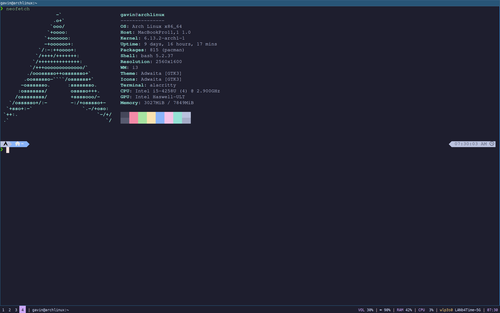

+++
title = "Revive An Old Macbook With Arch Linux"
date = "2025-02-23"
[taxonomies]
  tags = ["linux", "archlinux", "macos", "homelab"]
+++

This post walks through my experience installing Arch Linux on my old Macbook.

_Motivation_: My 2013 Macbook is in decent shape but the OS is no longer support and not upgradeable. Applications (like web browsers and Docker) continue to drop support. My options are either to buy a new Macbook 💵🫰 or switch operating systems.

## TLDR; 

Arch Linux is _much_ easier to install than it used to be. 

1. Download the [Arch ISO](https://archlinux.org/download/) to a USB
2. Hold down the "option" key while the Mac restarts to boot Arch linux.
3. Run `archinstall`
5. Hit inevitable "gotchyas". Read on for my advice.


*Arch Linux running on my old Mac*

## Materials

* An old Macbook
* A spare USB
* A hardwired connection to your router. Once Arch loads you (most likely) won't be able to connect to wifi if you have a Broadcom chip. We'll need to install the correct drivers for that. And you'll need a way to download them so grab an ethernet cord.


## Boot the Arch ISO

1. Download the archlinux.iso and copy to a usb drive.
2. Hold down option while the Macbook restarts.
3. Select archlinux iso

## Install Arch

Once the system boots you'll be presented with a TTY. Run `archinstall`. 

Typecraft has a great Youtube [video](https://www.youtube.com/watch?v=8YE1LlTxfMQ)  that walks through the archinstall script and getting basic Arch packages set up. I won't try to repeat his great work. Follow the video.

## Inevitable "gotchyas"

The video installs Arch on a VM. I encountered some differences on the Mac.

### Wifi

Older Macs have Broadcom chips so wifi does not work right away. (Hence the need for ethernet). To get wifi working we will need to install and configure the correct driver.

```bash
# See if you can reach the internets. This will fail...
ping -c 3 archlinux.org

# Install things needed to use your broadcom chip
sudo pacman -S linux-headers broadcom-wl-dkms dkms

# Load the modules
sudo modprobe -r b43 bcma
sudo modprobe wl

# See that it's loaded
lsmod | grep wl

# Restart network manager
sudo systemctl restart NetworkManager

# Check your wifi name is available
nmcli device wifi list

# Connect to wifi
nmcli device wifi connect "your_ssid" password "your_password"

# It should say "connected" but you can run the same ping command from before just for fun
ping -c 3 archlinux.org
```
### Other Oddities I encountered

I needed to do additional configuring for the battery % to display and the brightness keys to work. These fixes are in my [dotfiles](https://github.com/gavinest/dotfiles) that I host publicly.

## Wrap-up

There's a lot more I want to do with my _new-ish_ Arch computer. I plan to use it as an entrypoint for the homelab I am making. And - of course - I want to [rice](https://www.reddit.com/r/unixporn/) it so it looks really cool. More to come.

