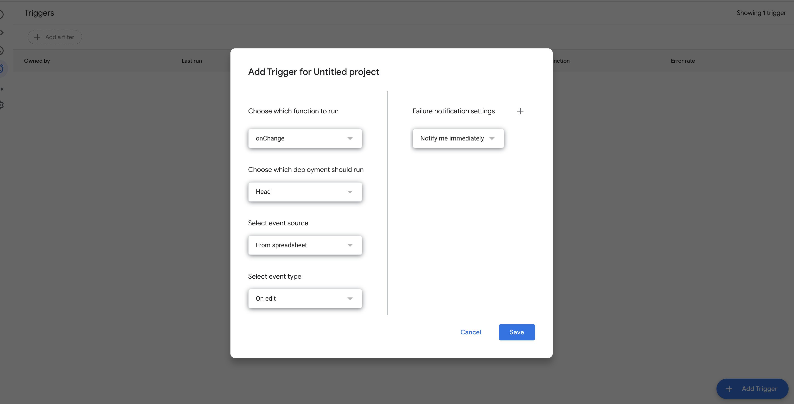
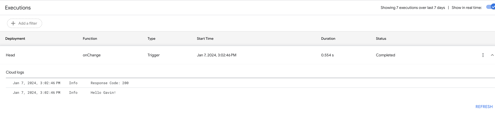

+++
title = "Trigger a Cloud Function from a Google Sheet Change"
date = "2024-01-15"
[taxonomies]
  tags = ["gcp", "python"]
+++

I want to trigger a [Google Cloud Function](https://cloud.google.com/functions/docs) whenever there is an edit to a [Google Sheet](https://www.google.com/sheets/about/).

This posts walks through how to do that.

# 1.  Make & Test the Function Locally

In a clean directory create the file `main.py` and copy the code below.

```python
# main.py
import functions_framework
from flask import Request
from flask.typing import ResponseReturnValue


@functions_framework.http
def main(request: Request) -> ResponseReturnValue:
    name = request.json["value"]
    return f"Hello {name}!"
```

Use the Python package [functions-framework](https://github.com/GoogleCloudPlatform/functions-framework-python) to run the function locally from the terminal.

```bash
# pip install functions-framework

$ functions-framework --target main --signature-type http --debug
 * Serving Flask app 'main'
 * Debug mode: on
WARNING: This is a development server. Do not use it in a production deployment. Use a production WSGI server instead.
 * Running on all addresses (0.0.0.0)
 * Running on http://127.0.0.1:8080
 * Running on http://192.168.0.15:8080
Press CTRL+C to quit
 * Restarting with watchdog (fsevents)
 * Debugger is active!
 * Debugger PIN: 132-316-387
```

Call the function to make sure it works locally.

```bash
$ curl -X POST http://127.0.0.1:8080 \
-H "content-type: application/json" \
-d '{"value": "Gavin"}'

Hello Gavin!
```

# 2. Deploy to Google Cloud

This part assumes you have the [Google SDK](https://cloud.google.com/sdk/docs/install) installed and a GCP project. Deploy the function to GCP.

```bash
$ PROJECT=mygcpproject # set to your Google Cloud Project name.

$ gcloud functions deploy myfunc \
    --project ${PROJECT} \
    --region us-central1 \
    --gen2 \
    --runtime python311 \
    --entry-point main \
    --trigger-http \
    --allow-unauthenticated
```

The function will take a moment to deploy. Once deployed copy the FUNCTION_URL and use it to test out your cloud function.

```bash
$ FUNCTION_URL=$(gcloud functions describe myfunc | grep url | awk '{print $2}')

$ curl -X POST ${FUNCTION_URL} \
-H "content-type: application/json" \
-d '{"value": "Gavin"}'

Hello Gavin!%
```

# 3. Create the Google Sheet Trigger

Now lets set up the Google Sheets trigger that will call this function when there is an edit to a Google Sheet.

This part will require a bit of [AppScript](https://developers.google.com/apps-script) (Google's Javascript-ish syntax for running code in Google Sheets). Don't worry the AppScript used here is minimal and it's not too bad.

On a new Google Sheet navigate to Extensions >> AppScript to open the AppScript coding window. This will take you to the AppScript editor. Click the "+" sign on the lefthand side to add a new "script" file. Call it "on_change".

Paste the code below into the newly created script file. Replace `${FUNCTION_URL}` with the url obtained in part 2.

```javascript
function onChange(event) {
  var url = "${FUNCTION_URL}";
  var options = {
    'method' : 'post',
    'contentType': 'application/json',
    'payload' : JSON.stringify({"value": event.value})
  };
  const response = UrlFetchApp.fetch(url, options)
  Logger.log('Response Code: ' + response.getResponseCode());
  Logger.log(response)
}
```

Next, we'll set up the trigger to call `onChange` when there is an edit to the spreadsheet.

Expand the lefthand pane and select "Triggers" >> "+ Add Trigger". Make sure the "event type" is "On Edit".

Different event types allow for different data to be available to AppScript. [Here](https://developers.google.com/apps-script/guides/triggers/events#Google%20Sheets-events) are docs on what data is available for each event type.



# 4. Test it out

On your Google Sheet, select a cell and change the value to your name.

Navigate to back to AppScript >> Executions. You should see an execution log similar to the below.



Congratulations. You just invoked a Cloud Function from an edit to a Google Sheet!

Don't forget to delete your function when you're done.

```bash
gcloud functions delete myfunc --gen2 --region us-central1
```
